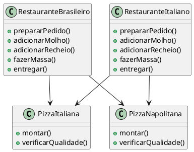
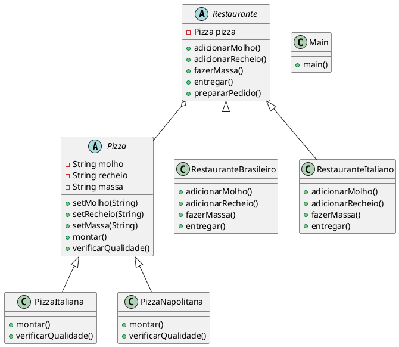

# Bridge

## Intenção

Desacoplar uma abstração da sua implementação, de modo que as duas possam variar
independentemente.

## Também conhecido como
Handle/Body

## Motivação 
Imagine que um restaurante precisa oferecer diferentes tipos de pizzas (Italiana, Napolitana, etc.), e que cada restaurante pode ter suas próprias variações na preparação da pizza. Se o código fosse implementado de forma tradicional, sem o Bridge, teríamos uma hierarquia rígida onde cada restaurante teria que implementar diretamente os detalhes da pizza.

Isso levaria a um alto acoplamento entre as classes, tornando difícil adicionar novos tipos de pizzas ou restaurantes sem modificar muitas partes do código. Por exemplo, se fosse necessário criar um Restaurante Japonês com uma pizza exclusiva, precisaríamos duplicar código ou modificar várias classes existentes.



#### Solução com Bridge:

- O padrão Bridge resolve esse problema ao separar a abstração (Restaurante) da implementação (Pizza), permitindo que os dois possam evoluir independentemente. Assim:

- Podemos adicionar novos tipos de pizza sem precisar modificar os restaurantes.

- Podemos adicionar novos tipos de restaurantes sem precisar modificar as pizzas.
Evitamos código duplicado, pois a lógica de montagem das pizzas fica encapsulada em suas próprias classes.



**Use o padrão Bridge quando:**

- desejar evitar um vínculo permanente entre uma abstração e sua implementação.
Isso pode ocorrer, por exemplo, quando a implementação deve ser selecionada
ou alterada em tempo de execução;

- quando as abstrações como suas implementações tiverem de ser extensíveis por
meio de subclasses. Neste caso, o padrão Bridge permite combinar as diferentes
abstrações e implementações e estendê-las independentemente;

-  mudanças na implementação de uma abstração não puderem ter impacto sobre
os clientes; ou seja, quando o código dos mesmos não puder ser recompilado.

- tiver uma proliferação de classes, como foi mostrado no primeiro diagrama da
seção Motivação. Tal hierarquia de classes indica necessidade de separar um
objeto em duas partes. 

- desejar compartilhar uma implementação entre múltiplos objetos (talvez usan-
do a contagem de referências) e este fato deve estar oculto do cliente. Um exemplo

  

## Estrutura


## Participantes:

- **Abstraction (Restaurante)**  
  - define a interface da abstração;
  -  mantém uma referência para um objeto do tipo Implementor.
  
- **RefinedAbstraction (RestauranteBrasileiro,RestauranteItaliano).**
  -  estende a interface definida por Abstraction.

- **Implementor (Pizza)**
  - define a interface para as classes de implementação. Essa interface não precisa corresponder exatamente à interface de Abstraction; de fato, as duas interfaces podem ser bem diferentes. A interface de Implementor fornece somente operações primitivas e Abstraction define operações de nível mais alto baseadas nessas primitivas.

- **ConcreteImplementor (PizzaNapolitana, PizzaItaliana)**
  - implementa a interface de Implementor e define sua implementação concreta.
 


## Colaborações: 
• Abstraction repassa as solicitações dos clientes para o seu objeto Implementor.

## Consequências:

1. Desacopla a interface da implementação. Uma implementação não fica permanentemente presa a uma interface. A implementação de uma abstração pode ser configurada em tempo de execução. É até mesmo possível para um objeto mudar sua implementação em tempo de execução. O desacoplamento de Abstraction e Implementor também elimina dependências em tempo de compilação da implementação. Mudar uma classe de implementação não requer a recompilação da classe Abstraction e seus clientes. Essa propriedade é essencial quando você quer assegurar compatibilidade no nível binário entre diferentes versões de uma biblioteca de classes.
        Além disso, esse desacoplamento encoraja o uso de camadas que podem
melhorar a estruturação de um sistema. A parte de alto nível de um sistema
somente tem que ter conhecimento de Abstraction e   Implementor.


2. Extensibilidade melhorada. Você pode estender as hierarquias de Abstraction
e Implementor independentemente.
3. Ocultação de detalhes de implementação dos clientes. Você pode proteger e isolar
os clientes de detalhes de implementação, tais como o compartilhamento de
objetos Implementor e o mecanismo de contagem de referências que os
acompanham (se houver).

## Implementação:

1. Um único Implementor: Se houver apenas uma implementação, a classe abstrata Implementor pode ser desnecessária. No entanto, a separação ainda é útil para evitar recompilações ao alterar a implementação.

2. Criando o Implementor correto: A escolha da implementação pode ser feita no construtor, com base em parâmetros, ou delegada a um Factory, garantindo desacoplamento entre Abstraction e Implementor.

3. Compartilhamento de Implementors: Pode-se usar a técnica Handle/Body para compartilhar implementações entre objetos, utilizando um contador de referências.

4. Herança Múltipla (C++): Em C++, herança múltipla pode combinar interface e implementação, mas fixa a implementação à interface, impedindo um verdadeiro Bridge.


### Exemplo:


#### Classe Restaurante - Abstraction
```java
package bridge;

public abstract class Restaurante {

    protected Pizza pizza;

    protected Restaurante(Pizza pizza) {
        this.pizza = pizza;
    }

    abstract void adicionarMolho();
    abstract void adicionarRecheio();
    abstract void fazerMassa();
    abstract void entregar();
    

    public void prepararPedido() {
        adicionarMolho();
        adicionarRecheio();
        fazerMassa();
        pizza.montar();
        pizza.verificarQualidade();
        System.out.println("Pizza pronta para ser entregue");    
    }
}
```
#### Classe RestauranteBrasileiro - RefinedAbstraction:
```java
package bridge;

public class RestauranteBrasileiro extends Restaurante {
    protected RestauranteBrasileiro(Pizza pizza) {
            super(pizza);
        }
    
    @Override
    void adicionarMolho() {
        pizza.setMolho("Molho de tomate");
    }

    @Override
    void adicionarRecheio() {
       pizza.setRecheio("Frango, Queijo e Catupiry");
    }

    @Override
    void fazerMassa() {
        pizza.setMassa("Massa Grossa");
    }

    
    @Override
    void entregar() {
       System.out.println("Entregando pizza");
    }

}
```

#### Classe RestauranteItaliano - RefinedAbstraction
```java
package bridge;

public class RestauranteItaliano extends Restaurante {

    protected RestauranteItaliano(Pizza pizza) {
            super(pizza);
        }
    
        @Override
    void adicionarMolho() {
        pizza.setMolho("Molho de tomate");
    }

    @Override
    void adicionarRecheio() {
       pizza.setRecheio("Frango");
    }

    @Override
    void fazerMassa() {
        pizza.setMassa("Massa fina");
    }


    @Override
    void entregar() {
       System.out.println("Entregando pizza italiana");
    }
}

```
#### Classe Pizza - Implementor

```java
package bridge;

public abstract class Pizza {
    protected String molho;
    protected String recheio;
    protected String massa;

    public void setMolho(String molho) {
        this.molho = molho;
    }

    public void setRecheio(String recheio) {
        this.recheio = recheio;
    }

    public void setMassa(String massa) {
        this.massa = massa;
    }

    public void montar() {
        System.out.println("Montando pizza com molho: " + molho + ", recheio: " + recheio + " e massa: " + massa);
    }

    public void verificarQualidade() {
        System.out.println("Verificando qualidade da pizza");
    }

    public void entregar() {
        System.out.println("Entregando pizza");
    }
}
```
#### Classe PizzaItaliana - ConcretImplementorA
```java
package bridge;

public class PizzaItaliana extends Pizza {
    @Override
    public void montar() {
        System.out.println("Montando pizza italiana com molho: " + molho + ", recheio: " + recheio + " e massa: " + massa);
    }

    @Override
    public void verificarQualidade() {
        System.out.println("Verificando qualidade da pizza italiana");
    }
    
}
```

#### Classe PizzaNapolitana - ConcretImplementorB

```java
package bridge;

public class PizzaNapolitana extends Pizza {

    @Override
    public void montar() {
        System.out.println("Montando pizza napolitana com molho: " + molho + ", recheio: " + recheio + " e massa: " + massa);
    }

    @Override
    public void verificarQualidade() {
        System.out.println("Verificando qualidade da pizza napolitana");
    }   
}
```

## Conclusão
O padrão Bridge é uma solução eficiente para reduzir o acoplamento entre a abstração e sua implementação, permitindo maior flexibilidade e facilidade de manutenção. No nosso exemplo, ele resolve o problema de uma hierarquia rígida onde cada restaurante estaria diretamente vinculado a tipos específicos de pizza, dificultando a adição de novos restaurantes ou novas pizzas sem modificar muitas classes.

Com o Bridge, podemos separar a lógica dos restaurantes (abstração) da implementação das pizzas, tornando o sistema mais modular e expansível. Assim, novos tipos de restaurantes ou pizzas podem ser adicionados sem impactar a estrutura existente, seguindo o princípio OCP (Open-Closed Principle), que incentiva sistemas abertos para extensão e fechados para modificação.


## Usos conhecidos:
Exemplos de Aplicação do Bridge
O Bridge pode ser aplicado em diversas áreas além do nosso exemplo de restaurantes e pizzas:

🔹 Interfaces gráficas multiplataforma:
Um framework de UI pode definir uma abstração genérica de janelas e botões, enquanto as implementações concretas variam conforme o sistema operacional (Windows, macOS, Linux).

🔹 Dispositivos e controle remoto:
Uma classe genérica de ControleRemoto pode funcionar com diferentes implementações de Dispositivos (TVs, Projetores, Sistemas de Som), sem que cada novo dispositivo exija mudanças no controle remoto.

🔹 Drivers de banco de dados:
Um sistema pode ter uma interface genérica para acesso a bancos de dados, enquanto as implementações concretas interagem com MySQL, PostgreSQL, SQLite, etc., permitindo trocar de banco sem modificar o código principal.

🔹 Formatos de arquivos:
Um sistema de exportação de relatórios pode ter uma interface única que permite exportar em diferentes formatos (PDF, CSV, XML), sem que a lógica de geração do relatório precise ser alterada.

O Bridge é especialmente útil quando há a necessidade de expansão futura do sistema sem impactar o código existente.


## Padrões relacionados
Um padrão Abstract Factory pode criar e configurar uma Bridge específicar.

## Referências


