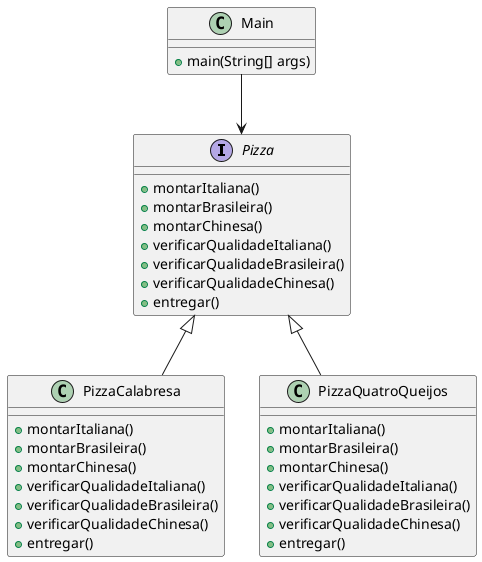
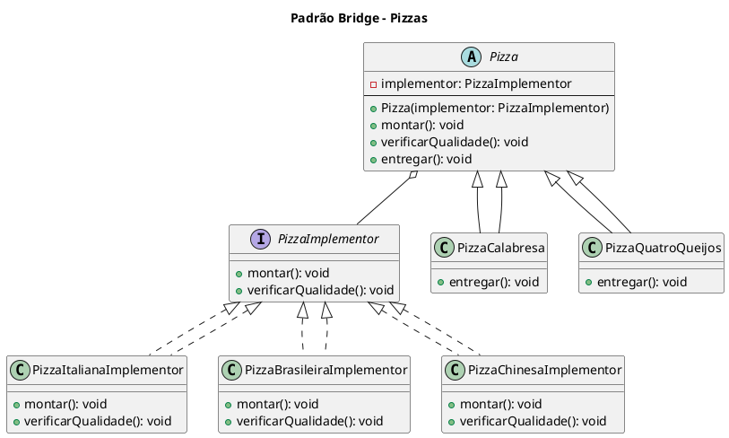

# Bridge

## Intenção

Desacoplar uma abstração da sua implementação, de modo que as duas possam variar
independentemente.

## Também conhecido como
Handle/Body

## Motivação 
sImagine que um restaurante precisa oferecer diferentes sabores de pizzas (Calabresa, Quatro Queijos, etc.), e que cada restaurante pode ter suas próprias variações na preparação desta pizza. No Brasil, essa pizza pode ser preparada de uma forma, na China outra e na Italia outra. Se o código fosse implementado de forma tradicional, sem o Bridge, teríamos uma hierarquia rígida onde cada tipo de pizza precisaria lidar diretamente com todas as variações de preparo.



Isso levaria a um alto acoplamento entre as classes, tornando difícil adicionar novos tipos de pizzas ou estilos de preparo sem modificar várias partes do código. Por exemplo, se fosse necessário adicionar um novo tipo de pizza (ex: Pizza Marguerita) ou um novo estilo de preparo (ex: Pizza Francesa), precisaríamos modificar todas as classes de pizzas existentes, adicionando novos métodos como montarFrancesa() e verificarQualidadeFrancesa().

Além disso, o código ficaria inflado com métodos duplicados, pois cada classe de pizza teria que implementar versões específicas de montar() e verificarQualidade() para cada estilo de preparo. Isso dificulta a manutenção e a escalabilidade, já que uma simples mudança na lógica de montagem afetaria diversas classes.

#### Com o Bridge:

Com o padrão Bridge, a separação entre tipos de pizza e estilos de preparo é clara. As pizzas se preocupam apenas em entregar, enquanto os estilos de preparo lidam com a montagem e a verificação de qualidade. Assim, podemos adicionar novos sabores de pizza ou novos estilos de preparo sem impactar as classes já existentes, tornando o código mais flexível, modular e fácil de manter. 


- Podemos adicionar novos tipos de pizza sem precisar modificar os modos de preparo no restaurantes.




**Use o padrão Bridge quando:**

- desejar evitar um vínculo permanente entre uma abstração e sua implementação.
Isso pode ocorrer, por exemplo, quando a implementação deve ser selecionada
ou alterada em tempo de execução;

- quando as abstrações como suas implementações tiverem de ser extensíveis por
meio de subclasses. Neste caso, o padrão Bridge permite combinar as diferentes
abstrações e implementações e estendê-las independentemente;

-  mudanças na implementação de uma abstração não puderem ter impacto sobre
os clientes; ou seja, quando o código dos mesmos não puder ser recompilado.

- tiver uma proliferação de classes, como foi mostrado no primeiro diagrama da
seção Motivação. Tal hierarquia de classes indica necessidade de separar um
objeto em duas partes. 

- desejar compartilhar uma implementação entre múltiplos objetos (talvez usan-
do a contagem de referências) e este fato deve estar oculto do cliente. Um exemplo

  

## Estrutura


## Participantes:

- **Abstraction (Pizza)**  
  - define a interface da abstração;
  -  mantém uma referência para um objeto do tipo Implementor.
  
- **RefinedAbstraction (PizzaCalabresa, PizzaQuatroQueijos).**
  -  estende a interface definida por Abstraction.

- **Implementor (PizzaImplementor)**
  - define a interface para as classes de implementação. Essa interface não precisa corresponder exatamente à interface de Abstraction; de fato, as duas interfaces podem ser bem diferentes. A interface de Implementor fornece somente operações primitivas e Abstraction define operações de nível mais alto baseadas nessas primitivas.

- **ConcreteImplementor (PizzaItalianaImplementor, PizzaBrasileiraImplementor, PizzaChinesaImplementor)**
  - implementa a interface de Implementor e define sua implementação concreta.
 


## Colaborações: 
• Abstraction repassa as solicitações dos clientes para o seu objeto Implementor.

## Consequências:

1. Desacopla a interface da implementação. Uma implementação não fica permanentemente presa a uma interface. A implementação de uma abstração pode ser configurada em tempo de execução. É até mesmo possível para um objeto mudar sua implementação em tempo de execução. O desacoplamento de Abstraction e Implementor também elimina dependências em tempo de compilação da implementação. Mudar uma classe de implementação não requer a recompilação da classe Abstraction e seus clientes. Essa propriedade é essencial quando você quer assegurar compatibilidade no nível binário entre diferentes versões de uma biblioteca de classes.
        Além disso, esse desacoplamento encoraja o uso de camadas que podem
melhorar a estruturação de um sistema. A parte de alto nível de um sistema
somente tem que ter conhecimento de Abstraction e   Implementor.


2. Extensibilidade melhorada. Você pode estender as hierarquias de Abstraction
e Implementor independentemente.
3. Ocultação de detalhes de implementação dos clientes. Você pode proteger e isolar
os clientes de detalhes de implementação, tais como o compartilhamento de
objetos Implementor e o mecanismo de contagem de referências que os
acompanham (se houver).

## Implementação:

1. Um único Implementor: Se houver apenas uma implementação, a classe abstrata Implementor pode ser desnecessária. No entanto, a separação ainda é útil para evitar recompilações ao alterar a implementação.

2. Criando o Implementor correto: A escolha da implementação pode ser feita no construtor, com base em parâmetros, ou delegada a um Factory, garantindo desacoplamento entre Abstraction e Implementor.

3. Compartilhamento de Implementors: Pode-se usar a técnica Handle/Body para compartilhar implementações entre objetos, utilizando um contador de referências.

4. Herança Múltipla (C++): Em C++, herança múltipla pode combinar interface e implementação, mas fixa a implementação à interface, impedindo um verdadeiro Bridge.


### Exemplo:


#### Classe Pizza - Abstraction
```java
public abstract class Pizza {
    protected PizzaImplementor implementor;

    public Pizza(PizzaImplementor implementor) {
        this.implementor = implementor;
    }

    public void montar() {
        implementor.montar();
    }

    public void verificarQualidade() {
        implementor.verificarQualidade();
    }

    public abstract void entregar();
}

```
#### Classe PizzaCalabresa, PizzaQuatroQueijos - RefinedAbstraction:
```java
public class PizzaCalabresa extends Pizza {
    public PizzaCalabresa(PizzaImplementor implementor) {
        super(implementor);
    }

    @Override
    public void entregar() {
        System.out.println("Entregando pizza de calabresa.");
    }
}

public class PizzaQuatroQueijos extends Pizza {
    public PizzaQuatroQueijos(PizzaImplementor implementor) {
        super(implementor);
    }

    @Override
    public void entregar() {
        System.out.println("Entregando pizza quatro queijos.");
    }
}

```

#### Classe PizzaImplementor - Implementor

```java
public interface PizzaImplementor {
    void montar();
    void verificarQualidade();
}
```
#### Classe PizzaItalianaImplementor, PizzaBrasileiraImplementor, PizzaChinesaImplementor - ConcretImplementor
```java
public class PizzaItalianaImplementor implements PizzaImplementor {
    @Override
    public void montar() {
        System.out.println("Montando pizza italiana.");
    }

    @Override
    public void verificarQualidade() {
        System.out.println("Verificando qualidade da pizza italiana.");
    }
}

public class PizzaBrasileiraImplementor implements PizzaImplementor {
    @Override
    public void montar() {
        System.out.println("Montando pizza brasileira.");
    }

    @Override
    public void verificarQualidade() {
        System.out.println("Verificando qualidade da pizza brasileira.");
    }
}

public class PizzaChinesaImplementor implements PizzaImplementor {
    @Override
    public void montar() {
        System.out.println("Montando pizza chinesa.");
    }

    @Override
    public void verificarQualidade() {
        System.out.println("Verificando qualidade da pizza chinesa.");
    }
}

```


## Conclusão
O padrão Bridge é uma solução eficiente para reduzir o acoplamento entre a abstração e sua implementação, permitindo maior flexibilidade e facilidade de manutenção. No nosso exemplo, ele resolve o problema de uma hierarquia rígida onde cada restaurante estaria diretamente vinculado a tipos específicos de pizza, dificultando a adição de novos restaurantes ou novas pizzas sem modificar muitas classes.

Com o Bridge, podemos separar a lógica dos restaurantes (abstração) da implementação das pizzas, tornando o sistema mais modular e expansível. Assim, novos tipos de restaurantes ou pizzas podem ser adicionados sem impactar a estrutura existente, seguindo o princípio OCP (Open-Closed Principle), que incentiva sistemas abertos para extensão e fechados para modificação.


## Usos conhecidos:
Exemplos de Aplicação do Bridge
O Bridge pode ser aplicado em diversas áreas além do nosso exemplo de restaurantes e pizzas:

🔹 Interfaces gráficas multiplataforma:
Um framework de UI pode definir uma abstração genérica de janelas e botões, enquanto as implementações concretas variam conforme o sistema operacional (Windows, macOS, Linux).

🔹 Dispositivos e controle remoto:
Uma classe genérica de ControleRemoto pode funcionar com diferentes implementações de Dispositivos (TVs, Projetores, Sistemas de Som), sem que cada novo dispositivo exija mudanças no controle remoto.

🔹 Drivers de banco de dados:
Um sistema pode ter uma interface genérica para acesso a bancos de dados, enquanto as implementações concretas interagem com MySQL, PostgreSQL, SQLite, etc., permitindo trocar de banco sem modificar o código principal.

🔹 Formatos de arquivos:
Um sistema de exportação de relatórios pode ter uma interface única que permite exportar em diferentes formatos (PDF, CSV, XML), sem que a lógica de geração do relatório precise ser alterada.

O Bridge é especialmente útil quando há a necessidade de expansão futura do sistema sem impactar o código existente.


## Padrões relacionados
Um padrão Abstract Factory pode criar e configurar uma Bridge específicar.

## Referências

GAMMA, Erich; HELM, Richard; JOHNSON, Ralph; VLISSIDES, John. Padrões de projeto: soluções reutilizáveis de software orientado a objetos. 1. ed. Porto Alegre: Bookman, 2000.


